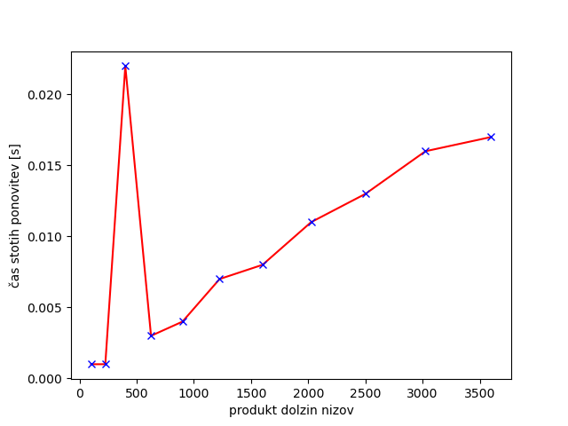
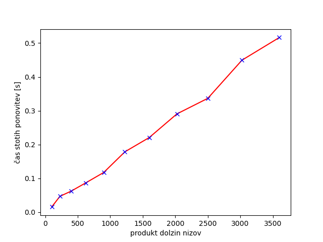

# Vaje 3

**Ime:** Tomaž Tratnik
**Datum:** 8.3.2022

# Uvod
Zaradi bolezni me ni bilo na vajah kjer se je delalo v skupini, zato sem si sam izbral in samostojno naredil nalogo za Levenshteinovo razdaljo.

# Ideja
Če imamo dva niza a in b, lahko razdaljo med njima izračunamo s pomikanjem po nizu. Na vsakem mestu imamo štiri možnosti. Če sta znaka na mestu i v nizu a in b enaka, ne naredimo nič. Če nista enaka pa lahko vstavimo, izbrišemo ali zamenjamo črko. Po vsakem koraku se pomaknemo za eno mesto naprej, dokler ne pridemo do konca od enega od nizov. Če nam na koncu v kakem nizu še ostanejo črke, se razdalji prišteje kar dolžina ostanka, ker bi ga morali izbrisati.

# Bellmanova enačba
Če z lev(a, b) označimo razdaljo med nizoma a in b, lahko zapišemo Bellmanovo enačbo kot lev(a, b) = 
{
len(a) če len(b) = 0 (moramo izbrisati prostale črke v a)
len(b) če len(a) = 0 (moramo izbrisati prostale črke v b)
lev(a[1:] b[1:]) če a[0] = b[0] (znaka enaka, se premaknemo naprej)
1 + min(lev(a[1:], b), lev(a, b[1:]), lev(a[1:], b[1:]))
}

V funkciji min predstavlja prvi izraz predstavlja izbris znaka, drugi predstavlja vstavitev znaka, tretji pa zamenjavo.

# Implementacija
Implementiral sem na dva različna načina, rekurzivno z memoizacijo in iterativno.

```
from functools import lru_cache

@lru_cache(maxsize = None)
def levenshtein_rek(a, b):
    if len(a) == 0:
        return len(b)
    if len(b) == 0:
        return len(a)
    if a[0] == b[0]:
        return levenshtein_rek(a[1:], b[1:])
    else:
        return 1 + min(levenshtein_rek(a[1:], b[1:]), levenshtein_rek(a[1:], b), levenshtein_rek(a, b[1:]))


def levenshtein_iter(a, b):
    
    if len(a) == 0 and len(b) == 0:
        return 0
    elif len(a) == 0:
        return len(b)
    elif len(b) == 0:
        return len(a)
    n = len(a) + 1
    m = len(b) + 1
    tab = [[0 for i in range(m)] for j in range(n)]
    for i in range(1, n):
        tab[i][0] = i
    for i in range(1, m):
        tab[0][i] = i    
    
    for i in range(1, m):
        for j in range(1, n):
            if a[j - 1] == b[i - 1]:
                cena = 0
            else:
                cena = 1
            tab[j][i] = min(tab[j - 1][i] + 1, tab[j][i - 1] + 1, tab[j - 1][i - 1] + cena)
    
    return tab[-1][-1]
```

# Časovna zahtevnost
Če z n in m označimo dolžni nizov, je časovna zahtevnost iterativnega pristopa O(n*m), saj se moramo sprehoditi čez celo tabelo velikosti (n+1)*(m+1). Rekurzivna funkcija z memoizacijo ima enako časovno odvisnost, brez memoizacije pa bi bila časovna zahtevnost O(3^n).

# Testi
```
>>> levenshtein_rek("", "")
0
>>> levenshtein_iter("", "")
0
```

```
>>> levenshtein_rek("", "bafgbuib")
8
>>> levenshtein_iter("", "bafgbuib")
8
```

```
>>> levenshtein_rek("racunalnik", "racunalnistvo")
4
>>> levenshtein_iter("racunalnik", "racunalnistvo")
4
```

```
>>> levenshtein_rek("abcdefghijklmnopqrstuvwxyz", "zyxwvutsrqponmlkjihgfedcba")
26
>>> levenshtein_iter("abcdefghijklmnopqrstuvwxyz", "zyxwvutsrqponmlkjihgfedcba")
26
```

```
>>> levenshtein_rek("Manhattan", "Manahaton")
3
>>> levenshtein_iter("Manhattan", "Manahaton")
3
```

Spodaj sta prikazana še grafa izvajanja obeh implementacij na naključno generiranih nizih v odvisnosti od produkta dolžin obeh nizov. V takem prikazu bi pričakovali linearno funkcijo.

Rekurzivna verzija z memoizacijo:


Iterativna verzija:
